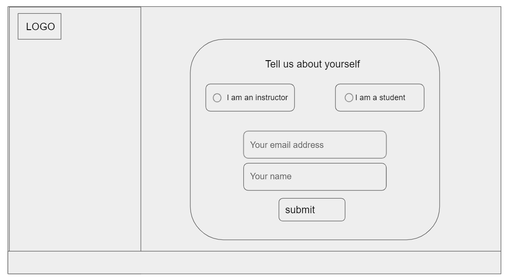

# BeeStrong
Start your fitness journey with BeeStrong.

*Project 2 - Group 3*

Code repository: https://github.com/raven-bootcamp/bee-strong

Deployed application (Heroku): https://bee-strong.herokuapp.com/

## Table of Contents
- [The Application](#the-application)
- [Instructions for Use](#instructions-for-use)
- [Workout Video Types](#workout-video-types)
- [Technical Instructions](#technical-instructions)
- [User Stories](#user-stories)
- [Acceptance Criteria](#acceptance-criteria)
- [Technologies Used](#technologies-used)
- [Database Design](#database-design)
- [Wireframes](#wireframes)
- [Mockups](#mockups)
- [Screenshots](#screenshots)

## The Application
BeeStrong is an open platform for sharing the right fitness content with the right students.  

Fitness instructors can upload fitness content, such as a pre-recorded video of a workout.  Uploaded content is given a tag, also known as category.

Fitness students/trainees can search for workouts based on the tagging system.  They can then add the workouts they like to their saved list for future use.

Instructors can see which students have subscribed to their content.

## Instructions for Use
### As a fitness instructor:
- create a new account, selecting the option "I am an instructor"
- when viewing the instructor dashboard, add a new workout with the "Add Content" button
- via the modal window: 
    - add a title
    - video link (currently must be a Youtube "embed" type link, see [Workout Video Types](#workout-video-types))
    - turn "Active" on
    - select the relevant tags for the content
    - click the "Save" button
- update a workout with the "Update" button
- delete a workout with the "Delete" button
- see subscribed students with the "Current Students" button

### As a fitness student:
- create a new account, selecting the option "I am a student"
- when viewing the student dashboard, search for content with the "Add Workouts" button
- click on a tag to see all content with that tag
- click on a course's star to add it to your saved list

## Workout Video Types
Fitness content is currently limited to Youtube videos that can be embedded. 

To get the "embedded" link of a video, the `watch?v=` part of the URL needs to be replaced by `embed` .

For example:

```
https://www.youtube.com/watch?v=dQw4w9WgXcQ
```
becomes
```
https://www.youtube.com/embed/dQw4w9WgXcQ
```

Future planning allows for the support of other types of media, not limited to embedded Youtube.
## Technical Instructions
If using the app locally, the assumption is that you have checked out the code to your computer and you have tools such as nodeJS and mySQL up and running.

From the base project directory:
```powershell
# install the required libraries
npm install

# set up the database and seed some sample data
npm run setup

# run the local server
npm run mon
```
The console will tell you which port to visit in your browser to use the application.
## User Stories
```
As a fitness instructor, 
I want to be able to upload my fitness content to a website
So that students can view and use the content that I offer
```
```
As a fitness student,
I want to be able to search for and view fitness content 
So that I can follow a structured workout system on a consistent basis
```
## Acceptance Criteria
```gherkin
Given I am a fitness instructor
When I view the Bee Strong website
Then I am shown a splash page with the ability to create an account
When I click on the Sign Up button to create an account
Then I am given the option of signing up as an instructor or a student
When I log into my instructor account
Then I can view, update, disable, enable or delete my content
When I click on the button to add new content
Then I can add new fitness content with a title, description, link and tag
When I click on the Delete Account button
Then I will be shown a confirmation window about deleting my account
When I click Yes to delete my account
Then all my fitness content is deleted as well
And I am logged out of the application
```
```gherkin
Given I am a fitness student
When I view the Bee Strong website
Then I am shown a splash page with the ability to create an account
When I click on the Sign Up button to create an account
Then I am given the option of signing up as an instructor or a student
When I log into my student account
Then I can search for fitness videos to watch, based on tag
When I click on a piece of content in my search results
Then I am taken to a detailed view of that content
And I have the option of adding the content to my saved list
When I view my saved list of content
Then I can view or remove any item from my list
When I click on an item in my list
Then I am taken to a detailed view of that content
When I click on the Delete Account button
Then I will be shown a confirmation window about deleting my account
When I click Yes to delete my account
Then I am logged out of the application
```
## Technologies Used
- Handlebars
- Bcrypt
- Nodemailer (for email)
- Bootstrap (for CSS)

## Database Design


## Wireframes




## Mockups


## Screenshots 

